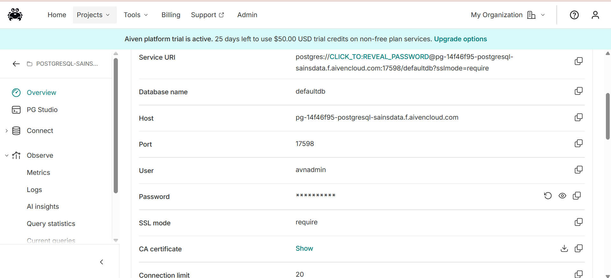
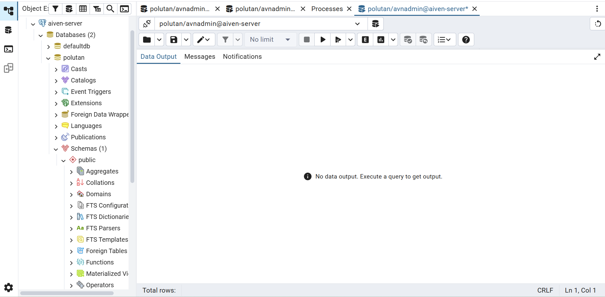
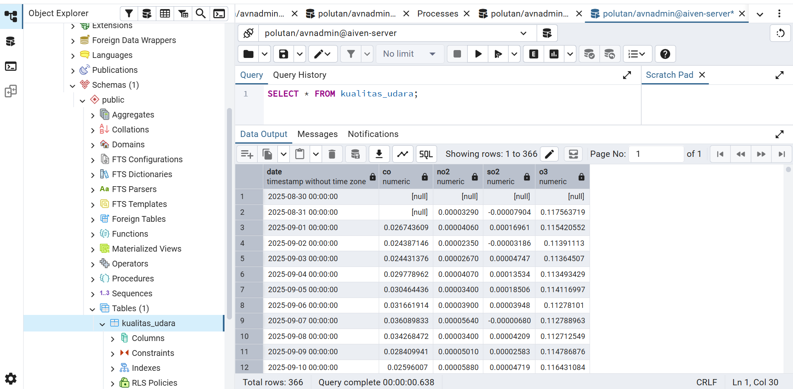
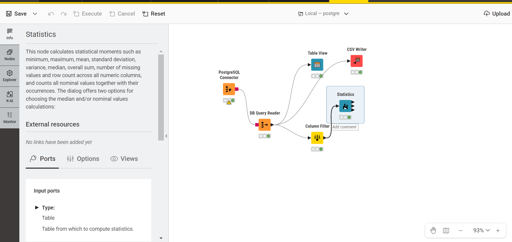
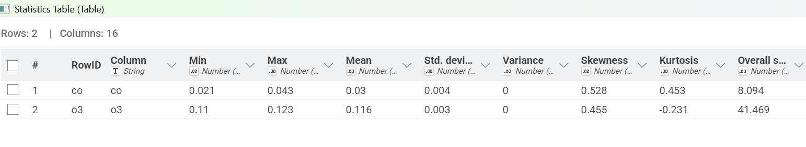
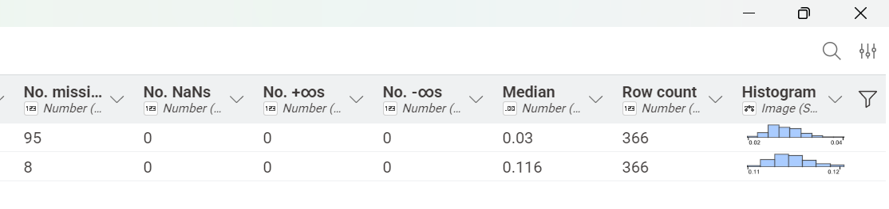

# Integrasi Data Kualitas Udara di Tuban menggunakan Aiven Cloud PostgreSQL, pgAdmin, dan Knime

Pada tugas ini memuat dokumentasi panduan langkah untuk manajemen analisis data kualitas udara di Kabupaten Tuban.

## 1. Pembuatan Akun dan Layanan PostgreSQL di Aiven

Langkah awal untuk menyediakan server database berbasis cloud yang dapat diakses dari mana saja.

1. Buka situs Aiven Console lalu buat akun baru atau masuk (login) menggunakan kredensial Anda

2. Pada halaman beranda konsol, klik tombol Create service

3. Pilih layanan database PostgreSQL

4. Pilih penyedia cloud (misalnya DigitalOcean, AWS, atau Google Cloud) serta pilih region server yang terdekat

5. Pilih paket layanan (bisa menggunakan paket Free tier atau Startup yang tersedia)

6. Beri nama layanan, lalu klik Create service

7. Tunggu beberapa saat hingga status layanan berubah menjadi Running

## 2. Pengambilan Kredensial dan Sertifikat SSL Aiven

Sebelum menghubungkan database ke pgAdmin, Anda memerlukan informasi koneksi serta sertifikat keamanan.

1. Masuk ke halaman Overview dari layanan PostgreSQL yang baru saja Anda buat di Aiven

2. Cari bagian Connection information:

Simpan semua informasi ini untuk mengkoneksikan ke pgadmin

## 3. Menghubungkan Aiven PostgreSQL ke pgAdmin 

Menghubungkan aplikasi manajemen basis data lokal (pgAdmin) ke server cloud Aiven

1. Buka aplikasi pgAdmin

2. Klik kanan pada folder Servers di panel kiri, pilih Create > Server...

3. Pada tab General, isi nama server (misal: Aiven Postgres)

Berikut tampilan ketika sudah berhasil terkoneksi dengan server aiven

## 4. Import File CSV Kualitas Udara Ke PostgreSQL

1. Di panel kiri pgAdmin, arahkan ke database Anda > Schemas > public > Tables

2. Klik kanan pada tabel kualitas_udara, lalu pilih Import/Export Data...

3. Pada tab General:

- Atur toggle Import/Export menjadi Import

- Pilih file KualitasUdaraTuban.csv pada bagian Filename

- Atur Format ke csv dan pastikan Header diatur ke Yes

Berikut tampilan ketika data sudah berhasil di import ke pgAdmin:

## 5. Integrasi Data Menggunakan Knime

Menghubungkan data dari Aiven PostgreSQL ke KNIME Analytics Platform untuk pengolahan lebih lanjut. Konfigurasikan Host, Port, Database name, User, dan Password yang disesuaikan dengan kredensial Aiven.

Berikut nodes - nodes yang digunakan:

## 6. Penjelasan, Rumus, dan Contoh Perhitungan dari Seluruh Fitur pada Nodes *Statistik*

Pada implementasi knime, kolom yang digunakan adalah **CO** dan **O3**, berikut hasil dari statistiknya

### 1. Column
Pada fitur **Column** berisi nama kolom yaitu sebagai polutan apa saja yang ada pada data, pada data tersebut terdapat **CO** dan **O3**.

### 2. Min
Pada fitur min berisi nilai minimal dari data pada setiap kolom, untuk nilai min dari pada **CO** dan **O3** sebagai berikut:

- **CO** = 0.0213

- **O3** = 0.1096

### 3. Max
Pada fitur max berisi nilai maximal dari data pada setiap kolom, untuk nilai max dari pada **CO** dan **O3** sebagai berikut:

- **CO** = 0.0432

- **O3** = 0.1229

### 4. Mean
Pada fitur mean berisi nilai rata-rata keseluruhan dari data valid, dihitung dengan menjumlahkan seluruh nilai data lalu dibagi dengan jumlah data valid ($n$).

**Rumus Mean:**

$$\bar{x} = \frac{1}{n} \sum_{i=1}^{n} x_i$$

**Contoh perhitungan:**

$$\bar{x} = \frac{1}{n} \sum_{i=1}^{n} x_i = \frac{x_1 + x_2 + x_3 + x_4 + \dots + x_{366}}{366}$$

$$\bar{x} = \frac{0.026743609 + 0.024387146 + 0.024431376 + \dots + x_{366}}{366}$$

Sehingga pada kolom **CO** dan **O3** diperoleh mean:

- **CO** = 0.0298
- **O3** = 0.1158

### 5. Standard Deviasi 
Standard Deviasi digunakan untuk mengetahui seberapa jauh sebaran angka - angka di dalam dataset dari nilai rata - rata. Jika nilai standard deviasi kecil artinya data-data berkumpul rapat disekitar nilai rata-rata, tetapi jika nilai standard deviasi besar artinya data menyebar sangat luas dan jauh dari rata - rata.

**Rumus Standard Deviasi:**

Berikut adalah rumus **standard deviasi sample:**

$$s = \sqrt{\frac{\sum_{i=1}^{n} (x_i - \bar{x})^2}{n - 1}}$$

Keterangan:

$s$ = Standar deviasi sampel

$x_i$ = Nilai data ke-$i$

$\bar{x}$ = Nilai rata-rata (mean)

$n$ = Jumlah total data valid (count)

Berikut adalah rumus **standard deviasi populasi:**

$$\sigma = \sqrt{\frac{1}{N} \sum_{i=1}^{N} (x_i - \mu)^2}$$

Keterangan:

$\sigma$ = Standar deviasi populasi

$x_i$ = Nilai data ke-$i$

$\mu$ = Nilai rata-rata populasi (population mean)

$N$ = Jumlah total keseluruhan data populasi

**Contoh perhitungan:**

Pada perhitungan ini akan dicontohnya untuk standard deviasi populasi, karena pada kolom **CO** terdapat missing value sebanyak 95, maka untuk $N$ pembagi menjadi $366 - 95 = 271$

$$\sigma = \sqrt{\frac{1}{N} \sum_{i=1}^{N} (x_i - \mu)^2}$$

$$\sigma = \sqrt{\frac{1}{271} \sum_{i=1}^{271} (0.026743609 - 0.029867452)^2}$$

$$\sigma = \sqrt{\frac{1}{271} \left[ (0.026743609 - 0.029867452)^2 + (0.024387146 - 0.029867452)^2 + (0.024431376 - 0.029867452)^2 + \dots + (x_{271} - 0.029867452)^2 \right]}$$

$$\sigma = \sqrt{\frac{1}{271} \left[ (-0.003123843)^2 + (-0.005480306)^2 + (-0.005436076)^2 + \dots + (x_{271} - \mu)^2 \right]}$$

$$\sigma = \sqrt{\frac{1}{271} \left[ 0.000009758 + 0.000030034 + 0.000029551 + \dots + (x_{271} - \mu)^2 \right]}$$

$$\sigma = \sqrt{\frac{\sum_{i=1}^{271} (x_i - \mu)^2}{271}}$$

$$\sigma = \sqrt{\frac{0.0033169111}{271}} = \sqrt{0.0000122395} = \mathbf{0.0034985} \approx \mathbf{0.00350}$$

Sehingga pada kolom **CO** dan **O3** diperoleh standard deviasi:

- **CO** = 0.003498503

- **O3** = 0.002523989

### 6. Variansi
Pada fitur variansi ini merupakan ukuran penyebaran statistik yang mengukur seberapa jauh setiap angka dalam kumpulan data tersebar dari nilai rata-ratanya. Hubungannya dengan **standard deviasi** adalah variansi merupakan kuadrat dari standard deviasi ($\text{Varians} = s^2$ atau $\sigma^2$). Variansi sangat kecil, berarti data berkumpul sangat dekat dengan nilai rata - rata (stabil), tetapi jika variansi sangat besar berarti data menyebar sangat jauh dengan nilai rata - rata (bervariasi).

**Rumus variansi:**

Berikut adalah rumus **variansi sample:** Digunakan jika data hanya mengambil sebagian kecil (sampel) dari populasi

$$s^2 = \frac{1}{n - 1} \sum_{i=1}^{n} (x_i - \bar{x})^2$$

Berikut adalah rumus **standard variansi populasi:** Digunakan jika data mencakup keseluruhan populasi secara penuh

$$\sigma^2 = \frac{1}{N} \sum_{i=1}^{N} (x_i - \mu)^2$$

**Contoh Perhitungan:**

Untuk perhitungan pada variansi cukup dengan mengkuadratkan standard deviasi yang sudah kita ketahui, yaitu sebagai berikut untuk contoh perhitungan variansi populasi pada **CO**:

$$\text{Varians} = \sigma^2$$

$$\text{Varians} = 0.003498503^2$$

$$\text{Varians} = 1.22E-05$$

$1.22E-05$ merupakan bilangan desimal positif yang nilainya sangat kecil atau mendeketi $0$

Sehingga pada kolom **CO** dan **O3** diperoleh standard deviasi:

- **CO** = 1.22E-05

- **O3** = 6.37E-06

Dari hasil variansi pada **CO** dan **O3** merupakan bilangan desimal positif yang sangat kecil, maka pada tools knime hasilnya adalah $0$.

### 7. Skewness
Skewnes merupakan bentuk penyebaran data apakah simestris atau tidak simetris (miring) terhadap nilai rata - ratanya. Kurvan distribusi normal yang sempurna memiliki nilai skewnes = $0$.

Berdasarkan arah kemiringannya dibedakan menjadi :

- Skewness Positif (Right Skewed) : Nilainya > 0, kurva menjulur ke kanan artinya data sebagian besar berkumpul di kiri (nilai rendah) tetapi ada beberapa data yang bernilai tinggi

- Skewness Negatif (Left Skewed) : Nilainya < 0, kurva menjulur ke kiri artinya sebagian besar data terkonsentrasi di sisi kanan (nilai tinggi) dengan beberapa nilai rendah

- Simetris : Nilainya mendekati 0, distribusi data seimbang antara kiri dan kanan 

**Rumus skewness:**

Berikut adalah rumus **skewness populasi:**

$$\text{Skewness} = \frac{n}{(n - 1)(n - 2)} \sum_{i=1}^{n} \left( \frac{x_i - \bar{x}}{s} \right)^3$$

Keterangan:

- $n =$ jumlah total data valid

- $\bar{x} =$ rata-rata

- $s =$ standar deviasi sample

**Contoh Perhitungan:**

Untuk perhitungan pada skewness dari kolom **CO** dan mengikuti rumus di atas maka cara perhitungannya adalah:

- menghitung rata - rata terlebih dahulu $\mu$

$$\mu = \frac{\sum_{i=1}^{271} x_i}{271} = \frac{8.09407961}{271} = \mathbf{0.02986745}$$

$271$ adalah nilai $n$ yang dimana merupakan jumlah data yang valid

- menghitung standard deviasi populasi ($\sigma$) yang dapat dihitung seperting nomor 5 tadi

$$\sigma^2 = \frac{\sum_{i=1}^{271} (x_i - \mu)^2}{271} = \frac{0.0033169111}{271} = 0.0000122395$$

$$\sigma = \sqrt{0.0000122395} = \mathbf{0.00349850}$$

Maka diperoleh :

Jumlah data valid ($n$): $271$

Rata-rata ($\bar{x}$): $0.02986745$

Standar deviasi sampel ($s$): $0.00349850$

- Subtitusi rumus skewness perkalian awal 

$$\frac{n}{(n - 1)(n - 2)}$$

$n = 271$, maka:

$$\frac{271}{(271 - 1)(271 - 2)} = \frac{271}{(270)(269)} = \frac{271}{72630} \approx \mathbf{0.00373125}$$

- Menghitung data harian $x_i$ dari ke-271, dikurangi rata-rata, dibagi standar deviasi, lalu dipangkatkan tiga

$$\left( \frac{x_1 - 0.02986745}{0.003505} \right)^3 + \left( \frac{x_2 - 0.02986745}{0.003505} \right)^3 + \dots + \left( \frac{x_{271} - 0.02986745}{0.003505} \right)^3$$

Selanjutnya jika seluruh ke-271 hasil pangkat tiga tersebut dijumlahkan ($\sum$), diperoleh total akumulasi:

$$\sum_{i=1}^{271} \left( \frac{x_i - \bar{x}}{s} \right)^3 \approx \mathbf{141.5065}$$

- Perkalian akhir dari penjumlahan akumulasi dengan perkalian awal

$$\text{Skewness} = 0.00373125 \times 141.5065 = \mathbf{0.528}$$

Sehingga pada kolom **CO** dan **O3** diperoleh skewness:

- **CO** = 0.528
- **O3** = 0.454

### 8. Kurtosis
Kurtosis adalah ukuran statistik yang mendeskripsikan seberapa runcing atau landai puncak suatu distribusi data dibandingkan dengan distribusi normal standar.

Berdasarkan bentuk puncaknya, kurtosis dibagi menjadi tiga:

1. Mesokurtic (Kurtosis Normal):

- Nilai excess kurtosis mendekati 0 (atau nilai kurtosis mentah bernilai 3)

- Bentuk puncaknya normal, seimbang, dan menyerupai kurva lonceng standar

2. Leptokurtic (Puncak Lancjang / Runcing)

- Nilainya > 0 (untuk excess kurtosis) atau > 3

- Bentuk puncaknya sangat tinggi dan lancip, dengan ekor yang tebal. Mengindikasikan bahwa data sangat terkonsentrasi di sekitar rata-rata, tetapi memiliki potensi kemunculan nilai ekstrem (outlier) yang lebih tinggi

3. Platykurtic (Puncak Landai / Datar)

- Nilainya < 0 (untuk excess kurtosis) atau < 3

- Bentuk puncaknya datar, lebar, dan landai, dengan ekor yang tipis. Ini menunjukkan bahwa data tersebar lebih merata dan jarang memiliki lonjakan nilai ekstrem

**Rumus Kurtosis:**

$$\text{Kurtosis} = \left[ \frac{n(n+1)}{(n-1)(n-2)(n-3)} \sum_{i=1}^{n} \left( \frac{x_i - \bar{x}}{s} \right)^4 \right] - \frac{3(n-1)^2}{(n-2)(n-3)}$$

Keterangan:

$n$ = Jumlah total data valid ($n = 271$ untuk parameter CO)

$x_i$ = Setiap nilai data satu per satu

$\bar{x}$ = Rata-rata (mean)

$s$ = Standar deviasi sampel

**Contoh Perhitungan:**

Dari rumus yang sudah diketahui, untuk perhitungannya maka mensubtitusikan rumus dengan data:

- Menghitung perkalian awal 

$$\frac{n(n+1)}{(n-1)(n-2)(n-3)}$$

$$\frac{271(271+1)}{(271-1)(271-2)(271-3)}$$

$$\frac{271(272)}{(270)(269)(268)}$$

$$\frac{73712}{19464720}$$

$$\frac{73,712}{19,464,720} \approx \mathbf{0.0037869}$$

- Menghitung pangkat 4 $\left( \frac{x_i - \bar{x}}{s} \right)^4$

Setiap data harian $x_i$ dikurangi rata-rata, dibagi standar deviasi sampel, lalu dipangkatkan empat

$$\left( \frac{x_1 - \bar{x}}{s} \right)^4 + \left( \frac{x_2 - \bar{x}}{s} \right)^4 + \dots + \left( \frac{x_{271} - \bar{x}}{s} \right)^4$$

Jika seluruh ke-271 hasil pangkat empat tersebut dijumlahkan ($\sum$), diperoleh total akumulasi momen keempat:

$$\sum_{i=1}^{271} \left( \frac{x_i - \bar{x}}{s} \right)^4 \approx \mathbf{920.78}$$

- Menghitung pengurang belakang

$$\frac{3(n-1)^2}{(n-2)(n-3)}$$

$$\frac{3(271-1)^2}{(271-2)(271-3)}$$

$$\frac{3(270)^2}{(269)(268)}$$

$$\frac{3(72900)}{72092}$$

$$\frac{218,700}{72,092} \approx \mathbf{3.03362}$$

- Kalkulasi Akhir

$$\text{Kurtosis} = (\text{Suku Depan} \times \text{Total Akumulasi Pangkat Empat}) - \text{Suku Belakang}$$

$$\text{Kurtosis} = (0.0037869 \times 920.78) - 3.03362$$

$$\text{Kurtosis} = 3.4869 - 3.03362 \approx \mathbf{0.4533}$$

Sehingga pada kolom **CO** dan **O3** diperoleh skewness:

- **CO** = 0.45330936135141897

- **O3** = -0.2307263752595727

### 9. Overall Sum

Overall sum adalah jumlah total keseluruhan dari seluruh nilai data valid yang terdapat pada suatu kolom atau fitur tertentu (setelah mengabaikan baris data yang kosong atau missing values)

**Rumus Overal Sum:**

$$\text{Overall Sum} = \sum_{i=1}^{n} x_i = x_1 + x_2 + x_3 + \dots + x_n$$

Keterangan:

$n$ = Jumlah total data valid ($n = 271$ untuk fitur CO)

$x_i$ = Setiap nilai data satu per satu yang valid

**Contoh Perhitungan:**

Dari rumus yang sudah diketahui, untuk perhitungannya maka mensubtitusikan rumus dengan data:

$$x_1 + x_2 + x_3 + \dots + x_{271}$$

Jika seluruh ke-271 nilai data valid pada kolom tersebut dijumlahkan satu per satu, diperoleh total keseluruhan:

$$\sum_{i=1}^{271} x_i \approx \mathbf{8.094}$$

Sehingga pada kolom **CO** dan **O3** diperoleh overall sum:

**CO** = 8.09407961

**O3** = 41.46912850

### 10. No Missing Value

No Missing Values adalah jumlah baris data yang kosong, tidak tercatat, atau bernilai null pada suatu kolom atau fitur tertentu di dalam dataset.

**Rumus No Missing Value:**

$$\text{Missing Values} = N_{\text{total}} - n$$

Keterangan:

$N_{\text{total}}$ = Jumlah total seluruh baris data dalam dataset ($N_{\text{total}} = 366$ untuk satu tahun penuh)

$n$ = Jumlah total data valid yang terisi dan berhasil dibaca oleh sistem

**Contoh Perhitungan:**

Dari rumus yang sudah diketahui, untuk perhitungannya maka mensubtitusikan rumus dengan data:

Menghitung selisih antara total baris data dengan jumlah data valid yang terisi

$$\text{Missing Values} = 366 - 271$$

$$\text{Missing Values} = \mathbf{95}$$

Sehingga pada kolom **CO** dan **O3** diperoleh jumlah missing values:

**CO** = 95

**O3** = 8

### 11. No Nans

No NaNs adalah jumlah baris data yang bernilai Not a Number (NaN) pada suatu fitur tertentu di dalam dataset. Nilai NaN biasanya muncul akibat adanya kesalahan komputasi atau hasil dari operasi matematika yang tidak terdefinisi (seperti $0/0$ atau akar kuadrat bilangan negatif).

**Rumus No Nans:**

$$\text{No NaNs} = \sum_{i=1}^{N_{\text{total}}} \mathbb{I}(x_i \text{ is NaN})$$

Keterangan:

$N_{\text{total}}$ = Jumlah total seluruh baris data dalam dataset ($N_{\text{total}} = 366$ untuk satu tahun penuh)

$\mathbb{I}(\dots)$ = Fungsi indikator yang bernilai 1 jika elemen data merupakan NaN dan 0 jika bukan

**Contoh Perhitungan:**

Dari rumus yang sudah diketahui, untuk perhitungannya maka mensubtitusikan rumus dengan data:

Karena seluruh data yang ada tidak memiliki cacat komputasi atau hasil operasi ilegal (data yang kosong tercatat sebagai Missing Values, bukan kerusakan format NaN), maka total akumulasi nilainya adalah:

$$\text{No. NaNs} = \mathbf{0}$$

Sehingga pada kolom **CO** dan **O3** diperoleh jumlah NaNs:

**CO** = 0

**O3** = 0

### 12. No. +∞s (Positive Infinity)

No. +∞s adalah jumlah baris data yang bernilai tak terhingga positif (positive infinity / $+\infty$) pada suatu kolom atau fitur tertentu di dalam dataset. Nilai ini biasanya muncul akibat adanya operasi aritmatika yang hasilnya melampaui batas kapasitas penyimpanan komputer atau hasil pembagian angka positif dengan nol (misalnya $x / 0$ di mana $x > 0$).

**Rumus No +∞s**

$$\text{No. +\infty s} = \sum_{i=1}^{N_{\text{total}}} \mathbb{I}(x_i = +\infty)$$

Keterangan:

$N_{\text{total}}$ = Jumlah total seluruh baris data dalam dataset ($N_{\text{total}} = 366$ untuk satu tahun penuh)

$\mathbb{I}(\dots)$ = Fungsi indikator yang bernilai 1 jika elemen data bernilai tak terhingga positif dan 0 jika bukan

**Contoh Perhitungan:**

Dari rumus yang sudah diketahui, untuk perhitungannya maka mensubtitusikan rumus dengan data:

Melakukan pemindaian (scanning) pada setiap baris data untuk mendeteksi adanya hasil pembagian dengan nol atau limpahan nilai positif tak berhingga

$$\text{Pemeriksaan keseluruhan baris data dari baris ke-1 sampai ke-366}$$

Karena seluruh data pengukuran parameter kualitas udara tersimpan dalam rentang angka riil yang wajar dan tidak ditemukan hasil komputasi yang melampaui batas tak terhingga positif, maka total akumulasi nilainya adalah:

$$\text{No. +\infty s} = \mathbf{0}$$

Sehingga pada kolom **CO** dan **O3** diperoleh jumlah +∞s:

**CO** = 0

**O3** = 0

### 13. No. -∞s (Negative Infinity)

No. -∞s adalah jumlah baris data yang bernilai tak terhingga negatif (negative infinity / $-\infty$) pada suatu kolom atau fitur tertentu di dalam dataset. Nilai ini biasanya muncul akibat adanya operasi aritmatika seperti pembagian angka negatif dengan nol (misalnya $-x / 0$) atau hasil fungsi logaritma dari nilai nol.

**Rumus No. -∞s:**

$$\text{No. -\infty s} = \sum_{i=1}^{N_{\text{total}}} \mathbb{I}(x_i = -\infty)$$

Keterangan:

$N_{\text{total}}$ = Jumlah total seluruh baris data dalam dataset ($N_{\text{total}} = 366$ untuk satu tahun penuh)

$\mathbb{I}(\dots)$ = Fungsi indikator yang bernilai 1 jika elemen data bernilai tak terhingga negatif dan 0 jika bukan

**Contoh Perhitungan:**

Dari rumus yang sudah diketahui, untuk perhitungannya maka mensubtitusikan rumus dengan data:

Melakukan pemindaian (scanning) pada setiap baris data untuk mendeteksi adanya hasil operasi yang menghasilkan nilai negatif tak berhingga

$$\text{Pemeriksaan keseluruhan baris data dari baris ke-1 sampai ke-366}$$

Karena seluruh data pengukuran parameter kualitas udara berupa angka positif yang valid dan tidak ditemukan hasil komputasi yang menuju tak terhingga negatif, maka total akumulasi nilainya adalah:

$$\text{No. -\infty s} = \mathbf{0}$$

Sehingga pada kolom **CO** dan **O3** diperoleh jumlah -∞s:

**CO** = 0

**O3** = 0

### 14. Median

Median adalah nilai tengah dari sekumpulan data valid yang telah diurutkan dari nilai terkecil hingga terbesar. Jika jumlah data ($n$) ganjil, median adalah nilai yang berada tepat di tengah. Jika $n$ genap, median adalah rata-rata dari dua nilai yang berada di tengah.

**Rumus Median:**

$$\text{Median} = \begin{cases}  x_{\left(\frac{n+1}{2}\right)} & \text{jika } n \text{ ganjil} \\  \frac{1}{2} \left( x_{\left(\frac{n}{2}\right)} + x_{\left(\frac{n}{2} + 1\right)} \right) & \text{jika } n \text{ genap}  \end{cases}$$

Keterangan:

$n$ = Jumlah total data valid

$x$ = Data yang telah diurutkan secara ascending (dari kecil ke besar)

**Contoh Perhitungan:**

Dari rumus yang sudah diketahui, untuk perhitungannya maka mensubtitusikan rumus dengan data:

Mengurutkan seluruh data valid dari terkecil hingga terbesar, lalu menentukan posisi titik tengahnya berdasarkan jumlah $n$

$$\text{Posisi Median} = \frac{n + 1}{2}$$

Jika disubstitusikan untuk parameter CO ($n = 271$, yang merupakan bilangan ganjil):

$$\text{Posisi Median} = \frac{271 + 1}{2} = \frac{272}{2} = \text{Data ke-136}$$

Setelah mencari data pada urutan ke-136 dari kumpulan data valid yang telah diurutkan, diperoleh nilai tengahnya:

$$\text{Median} \approx \mathbf{0.0295}$$

Sehingga pada kolom **CO** dan **O3** diperoleh nilai median:

**CO** = 0.0295 (atau sesuai dengan titik tengah urutan data valid masing-masing parameter)

**O3** = 0.1155 (mengikuti sebaran titik tengah data valid parameter O3)

### 15. Row Count

Row Count adalah jumlah total baris yang terdapat di dalam suatu kolom, mencakup seluruh data baik yang terisi penuh (valid) maupun baris yang kosong (missing values).

**Rumus Row Count:**

$$\text{Row Count} = N_{\text{total}} = n + \text{Missing Values}$$

Keterangan:

$N_{\text{total}}$ = Jumlah total seluruh baris data dalam dataset

$n$ = Jumlah total data valid yang terisi

$\text{Missing Values}$ = Jumlah baris data yang kosong atau null

**Contoh Perhitungan:**

Dari rumus yang sudah diketahui, untuk perhitungannya maka mensubtitusikan rumus dengan data:

Menjumlahkan total data valid dengan jumlah baris yang kosong (missing values) pada parameter CO:

$$\text{Row Count} = 271 + 95$$

$$\text{Row Count} = \mathbf{366}$$

(Begitu pula jika dihitung dari parameter O3: $358 \text{ (data valid)} + 8 \text{ (missing values)} = 366$).

Sehingga pada kolom **CO** dan **O3** diperoleh total row count:

**CO** = 366

**O3** = 366